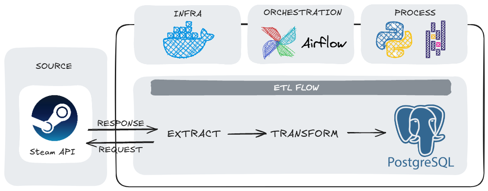

# 📉 Steam Data Pipeline 

Pipeline ETL *end-to-end* para ingestão, transformação e análise histórica dos jogos mais populares da Steam usando **Python**, **Apache Airflow**, **Docker** e **PostgreSQL**.

---

## 📖 Visão Geral

O objetivo deste projeto é monitorar tendências de jogos em tempo real, criando um histórico ("série temporal") para analisar quais jogos estão ganhando ou perdendo popularidade.

- **Extração:** Coleta dados da API oficial da Steam.
- **Transformação:** Limpeza, normalização e *timestamping* dos dados.
- **Carga:** Insere os dados processados em um banco PostgreSQL.
- **Orquestração:** Todo o fluxo é automatizado via **Apache Airflow**.

---

## 🏗️ Arquitetura do Pipeline



---

## 🛠️ Stack Tecnológica

### Core
- **Python** - Linguagem principal
- **Apache Airflow** - Orquestração do pipeline
- **PostgreSQL** - Banco de dados relacional
- **Docker & Docker Compose** - Containerização

### Bibliotecas Python
- **pandas** - Manipulação e transformação de dados
- **requests** - Requisições HTTP para a API
- **SQLAlchemy** - ORM para interação com o banco de dados
- **psycopg2** - Driver PostgreSQL
- **python-dotenv** - Gerenciamento de variáveis de ambiente

### Outras Ferramentas
- **Redis** - Message broker para Celery
- **Jupyter Notebook** - Análise exploratória de dados
- **UV** - Gerenciador de pacotes Python rápido

---

## 🗂️ Estrutura do Projeto

```text
steam-etl-pipeline/
├── config/                # Configurações do pipeline (ignorado pelo git)
│   └── .env               
├── dags/                  # Diretório mapeado para o Airflow
│   ├── steam_dag.py       
├── data/                  # Dados extraídos (ignorado pelo git)
├── logs/                  # Logs do Airflow (ignorado pelo git)
├── plugins/               # Plugins do Airflow (ignorado pelo git)
├── notebooks/             # Notebook de análise e exploração
├── src/                   # Código fonte do ETL
│   ├── extract_data.py
│   ├── transform_data.py
│   └── load_data.py
├── .env                   
├── docker-compose.yaml    # Orquestração dos containers
├── main.py                # Usado para testar o pipeline
└── README.md
```

## 🧩 Principais Arquivos

- `dags/steam_dag.py`: DAG principal do Airflow
- `src/extract_data.py`: Função de extração da API
- `src/transform_data.py`: Funções de transformação
- `src/load_data.py`: Função de carga no PostgreSQL
- `main.py`: Execução manual do pipeline

---

## 🔍 Detalhamento das Etapas

### 📥 **ETAPA 1: EXTRACT**

**Arquivo:** [`src/extract_data.py`](src/extract_data.py)

**O que faz:**
1. Realiza requisições GET para os endpoints da Steam Web API:
- ISteamChartsService/GetGamesByConcurrentPlayers (Ranking)
- IStoreService/GetAppList (Nomes dos Jogos)
2. Salva os dados brutos em formato JSON na pasta dags/data/.

**Dados coletados:**
- Rank atual
- ID do Jogo (AppID)
- Número de jogadores simultâneos
- Pico de jogadores nas últimas 24h

---

### 🔄 **ETAPA 2: TRANSFORM**

**Arquivo:** [`src/transform_data.py`](src/transform_data.py)

**O que faz:**

#### 2.1 **Criação dos DataFrames**
- Lê os arquivos JSON
- Converte para DataFrame Pandas

#### 2.2 **Merge e Limpeza**
- Cruza as informações do Ranking com a lista de Apps (merge via appid).
- Remove colunas desnecessárias para a análise (ex: last_modified, price_change_number).
- Renomeia as colunas para padronização de nomes claros.

#### 2.3 **Tratamento de dados Nulos**
- Para 'game_title' null, utilizamos "Desconhecido".

#### 2.4 **Criação de Série Temporal**
- Adiciona a coluna 'extracted_at' com data/hora atual.

**Resultado:** DataFrame limpo, estruturado e pronto para análise

---

### 💾 **ETAPA 3: LOAD**

**Arquivo:** [`src/load_data.py`](src/load_data.py)

**O que faz:**

#### 3.1 **Conexão com o banco de dados**
```python
engine = create_engine(
    f"postgresql+psycopg2://{user}:{password}@{host}:5432/{database}"
)
```

#### 3.2 **Inserção dos dados**
```python
df.to_sql(
        name=table_name,
        con=engine,
        if_exists='append',
        index=False
    )
```

#### 3.3 **Validação**
- Faz um `SELECT COUNT(*)` para verificar total de registros
- Loga o resultado para auditoria


---

## 🐳 Infraestrutura e Orquestração

### 1. Docker (Containerização)
O projeto é totalmente isolado utilizando containers Docker, garantindo que o pipeline funcione em qualquer máquina sem conflitos de dependência.
- **Serviços:** O `docker-compose.yaml` orquestra múltiplos serviços simultaneamente: Airflow (Webserver, Scheduler, Triggerer) e o banco de dados PostgreSQL.
- **Persistência de Dados:** Utilizamos volumes Docker para garantir que os dados do banco (`postgres-db-volume`) não sejam perdidos ao reiniciar os containers.
- **Networking:** Configuração de rede interna para permitir a comunicação direta entre o Airflow e o Postgres.

### 2. Apache Airflow (Orquestração)
O gerenciamento do fluxo de dados é feito pelo Airflow.
- **TaskFlow API:** O código utiliza a abordagem moderna do Airflow 2.0+ (`@dag`, `@task`), tornando o código mais limpo e legível.
- **Dependências:** O fluxo é linear (`extract` >> `transform` >> `load`), garantindo que uma etapa só inicie se a anterior for concluída com sucesso.
- **Idempotência:** O pipeline foi desenhado para rodar múltiplas vezes sem quebrar, apenas adicionando novos registros históricos.

---

## ⚙️ Como Executar

### 1. Pré-requisitos
- **Docker** e **Docker Compose** instalados na máquina.
- Uma **API Key da Steam** (você pode obter gratuitamente [aqui](https://steamcommunity.com/dev/apikey)).

### 2. Configuração do Ambiente

Crie um arquivo chamado `.env` dentro da pasta `config/` e preencha com suas credenciais:

```env
# Configurações da API Steam
API_KEY=sua_chave_aqui

# Configurações do Banco de Dados (Postgres)
# Nota: 'host.docker.internal' permite que o container acesse o host/outros serviços
DB_HOST=host.docker.internal
DB_NAME=steam_data
DB_USER=airflow
DB_PASS=airflow
DB_PORT=5432
```
### 3. Inicialização

Na raiz do projeto, abra o terminal e execute:

```bash
# Sobe os containers em segundo plano (Detached mode)
docker-compose up -d
```

### 4. Acessando o Projeto
1.  Aguarde alguns instantes para a inicialização completa dos serviços.
2.  Acesse a interface do Airflow em: [http://localhost:8080](http://localhost:8080)
3.  Faça login com as credenciais padrão:
    - **Usuário:** `airflow`
    - **Senha:** `airflow`
4.  Localize a DAG **`steam_pipeline`**, ative o botão (Unpause/Toggle Azul) e dispare a execução (Trigger/Play ▶️).

---

## 📌 Referência

Este projeto foi inspirado em um conteúdo do canal [**vbluuiza**](https://youtu.be/I8qPqbXQBDU?si=lbhwEALHXY7vN4NN) e adaptado para fins de aprendizado.

---

## 👩‍💻 Desenvolvido por

- **Nome:** Isadora Torqueti
- **GitHub:** https://github.com/isatorqueti
- **Linkedin:** https://www.linkedin.com/in/isadoratorqueti/